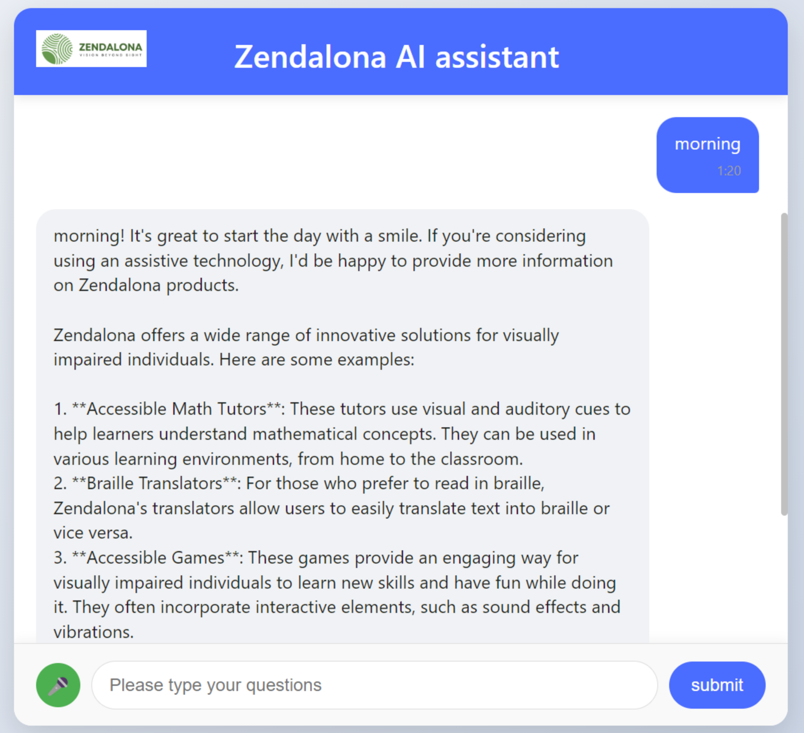
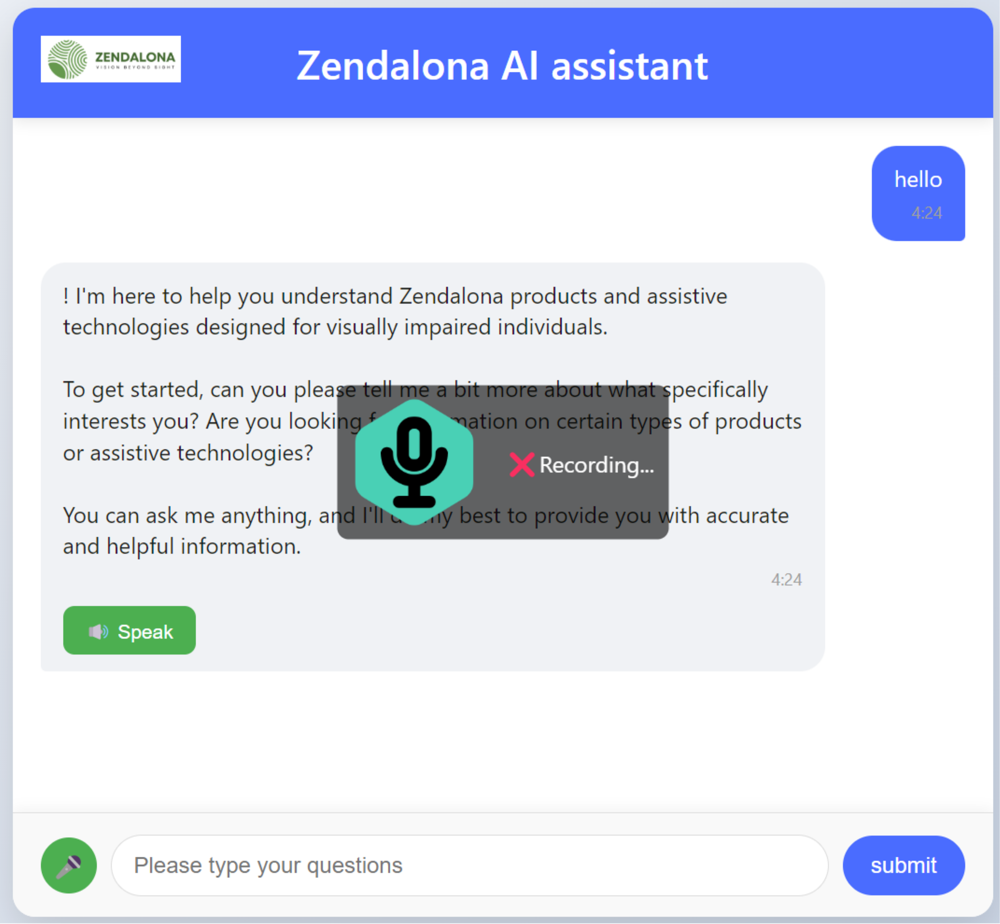

# AI Agent for Zendalona

This project is a demonstration for the **Zendalona GSOC 2025 application**. It showcases an AI-powered agent designed to provide support for Zendalona products, focusing on accessibility for visually impaired users.

## Features

- **Multi-turn Conversations**: The agent supports ongoing conversations, allowing for seamless multi-turn interactions.
- **Local Deployment**: Utilizes **Ollama** for the easy deployment and operation of large language models directly on local machines, without requiring external services.
- **Text-to-Speech (TTS)**: Converts AI-generated responses into speech for enhanced accessibility.
- **Speech-to-Text (STT)**: Allows users to interact with the agent using voice commands, converting speech into text for processing.
- **Zendalona Projects Database**: The agent is integrated with a comprehensive database of Zendalona products and projects, providing real-time information to users.
- **Powered by Llama3.2**: The agent uses **llama3.2**, a large language model, to process and generate responses to user queries.

## Demo

Below are some screenshots showcasing the demo of the AI agent in action:

